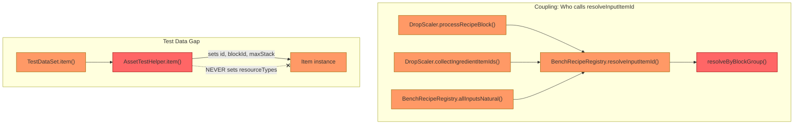

# Review: ResourceTypeId Resolution System

## 1. Executive Summary

The `resolveByBlockGroup()` method in `BenchRecipeRegistry` implements an entirely fabricated resolution strategy — BlockGroup scanning with prefix matching and `_All` suffix stripping — that does not match the engine's actual `ResourceTypeId` resolution, which uses direct string equality against `item.getResourceTypes()`. This incorrect approach propagates through `DropScaler.processRecipeBlock()`, `collectIngredientItemIds()`, and `allInputsNatural()`, producing non-deterministic results that depend on BlockGroup iteration order. The test data compounds the problem by never setting `resourceTypes` on test `Item` instances, so the tests validate the wrong algorithm against structurally incomplete fakes.

## 2. Current Architecture Diagram

```mermaid
graph TB
    subgraph "Current Plugin: resolveInputItemId()"
        A["MaterialQuantity.getItemId()"]
        B["MaterialQuantity.getResourceTypeId()"]
        C["resolveByBlockGroup(resId)"]
        D["Iterate ALL BlockGroups"]
        E["Prefix match: resId + '_'"]
        F["_All suffix strip: resId[0..-3]"]
        G["Find first block starting with prefix"]
        H["Lookup Item by block ID"]
        I["Return first match"]
    end

    A -->|"non-null"| I
    A -->|"null"| B
    B -->|"non-null"| C
    C --> D
    D --> E
    D --> F
    E --> G
    F --> G
    G --> H
    H --> I

    subgraph "Engine: CraftingManager.matches()"
        J["MaterialQuantity.getResourceTypeId()"]
        K["item.getResourceTypes()"]
        L["Iterate ItemResourceType[]"]
        M["resourceTypeId.equals(resourceType.id)"]
        N["Direct string equality match"]
    end

    J --> K
    K --> L
    L --> M
    M --> N

    style A fill:#f96,stroke:#960
    style B fill:#f96,stroke:#960
    style C fill:#f66,stroke:#900
    style D fill:#f66,stroke:#900
    style E fill:#f66,stroke:#900
    style F fill:#f66,stroke:#900
    style G fill:#f66,stroke:#900
    style H fill:#f96,stroke:#960
    style I fill:#f96,stroke:#960
    style J fill:#6c6,stroke:#060
    style K fill:#6c6,stroke:#060
    style L fill:#6c6,stroke:#060
    style M fill:#6c6,stroke:#060
    style N fill:#6c6,stroke:#060
```

### Coupling: Who calls resolveInputItemId

## 3. Findings Table

| # | Category | Location | Detail |
|---|----------|----------|--------|
| 1 | **Anti-pattern** | [BenchRecipeRegistry.java](../src/main/java/com/UnobstructedThirdPerson/resourcecollection/BenchRecipeRegistry.java#L151-L178) | `resolveByBlockGroup()` invents a prefix-matching + `_All`-suffix-stripping algorithm that does not exist in the engine. The engine uses `item.getResourceTypes()` with direct string equality (`resourceId.equals(resourceType.id)`) — confirmed in decompiled `CraftingManager.matches()`, `ItemContainer.getMatchingResourceType()`, and `ResourceQuantity.getResourceType()`. BlockGroups are unrelated to ResourceTypeId resolution. |
| 2 | **Anti-pattern** | [BenchRecipeRegistry.java](../src/main/java/com/UnobstructedThirdPerson/resourcecollection/BenchRecipeRegistry.java#L155-L161) | The `_All` suffix convention (`resId.endsWith("_All") → strip "All"`) is fabricated. In reality, `Wood_All` is a literal resource type ID — items like `Wood_Oak_Trunk` declare `"ResourceTypes": [{"Id": "Wood_All"}]` directly. No suffix processing occurs in the engine. |
| 3 | **Scalability** | [BenchRecipeRegistry.java](../src/main/java/com/UnobstructedThirdPerson/resourcecollection/BenchRecipeRegistry.java#L163-L178) | `resolveByBlockGroup()` iterates **all** BlockGroups × **all** blocks × potentially **all** items (inner scan by `blockId` field). This is O(G × B × I) when the engine's approach is O(I) or better with an index. With many block groups, this becomes a hot path during `init()`. |
| 4 | **Anti-pattern** | [BenchRecipeRegistry.java](../src/main/java/com/UnobstructedThirdPerson/resourcecollection/BenchRecipeRegistry.java#L165-L175) | Non-deterministic resolution. The method returns the **first** block whose name starts with the prefix, but iteration order of `blockGroupMap.getAssetMap()` (a `HashMap`) is unspecified. The resolved item ID varies across JVM invocations. |
| 5 | **Anti-pattern** | [DropScaler.java](../src/main/java/com/UnobstructedThirdPerson/resourcecollection/DropScaler.java#L265-L269) | `processRecipeBlock()` calls `resolveInputItemId()` which delegates to the broken `resolveByBlockGroup()` for any `ResourceTypeId` input. This means recipe blocks whose ingredients use ResourceTypeId (like Kweebec Bed with `Wood_All`) get a **wrong, non-deterministic** item chosen for their breaking drop. |
| 6 | **Anti-pattern** | [DropScaler.java](../src/main/java/com/UnobstructedThirdPerson/resourcecollection/DropScaler.java#L403-L419) | `collectIngredientItemIds()` uses the same broken resolution for all recipe inputs. Any `ResourceTypeId`-based input resolves to a wrong/random item, so the ingredient set used for drop list scaling may be incorrect. |
| 7 | **Anti-pattern** | [TestDataSet.java](../src/test/java/com/UnobstructedThirdPerson/resourcecollection/TestDataSet.java#L136-L138) | Test items are created via `item(id, blockId, hasBlockType, maxStack)` which never sets `resourceTypes`. In the real game, items like `Wood_Log_Oak` have `ResourceTypes: [{"Id": "Wood_Oak"}, {"Id": "Wood_Hardwood"}, {"Id": "Wood_All"}, ...]`. The tests can't validate ResourceType-based resolution because the fakes don't model the field. |
| 8 | **Anti-pattern** | [TestDataSet.java](../src/test/java/com/UnobstructedThirdPerson/resourcecollection/TestDataSet.java#L227-L232) | The Kweebec Bed recipe uses `materialQtyResource("Wood_All", 3)`, which correctly models the real JSON. But the test data provides no items with `ResourceTypes: [{"Id": "Wood_All"}]` — resolution only works because of the fake BlockGroups containing blocks with `Wood_` prefix names. This validates the wrong algorithm. |
| 9 | **Redundancy** | [TestDataSet.java](../src/test/java/com/UnobstructedThirdPerson/resourcecollection/TestDataSet.java#L249-L254) | Two synthetic BlockGroups (`FullBlocks_Blackwood`, `FullBlocks_Hardwood`) exist purely to feed `resolveByBlockGroup()`. These become unnecessary once resolution is fixed to use `item.getResourceTypes()`. |
| 10 | **Anti-pattern** | [ResourceScalingIntegrationTest.java](../src/test/java/com/UnobstructedThirdPerson/resourcecollection/ResourceScalingIntegrationTest.java#L308-L318) | `kweebecBedResolvesWoodAllToFirstMatchingWood` asserts that `Wood_All` resolves to "the first block in any BlockGroup that starts with `Wood_`". This is testing the wrong algorithm — in the engine, `Wood_All` should match any item whose `ResourceTypes` includes `{"Id": "Wood_All"}`, which could be `Wood_Oak_Trunk`, `Wood_Log_Oak`, etc. |

## 4. Target Architecture Diagram

**What changes:**
- `resolveByBlockGroup()` is replaced by `resolveByResourceType()` which iterates the Item asset map, checks `item.getResourceTypes()`, and matches by `resId.equals(resourceType.id)` — mirroring `CraftingManager.matches()` and `ItemContainer.getMatchingResourceType()` exactly.
- No prefix matching, no `_All` suffix stripping, no BlockGroup scanning.
- `resolveInputItemId()` signature is unchanged — all three callers (`processRecipeBlock`, `collectIngredientItemIds`, `allInputsNatural`) work without modification.

## 5. Migration Notes

### What can be deleted entirely
- `resolveByBlockGroup()` method in `BenchRecipeRegistry` (lines 151–178)
- The `_All` suffix stripping logic — it's a fabrication
- The `AssetRegistry.getAssetStore(BlockGroup.class)` import and usage in `BenchRecipeRegistry` — BlockGroup is not part of ResourceTypeId resolution
- `blockGroups` map in `TestDataSet` and the `createBlockGroup()` helper — only existed to feed the wrong algorithm
- `installBlockGroups()` in `AssetTestHelper` and the `AssetRegistry.storeMap` injection — no longer needed
- `items.put("Wood_Blackwood_Planks", ...)` and `items.put("Wood_Hardwood_Planks", ...)` in TestDataSet — existed only for BlockGroup tests

### What should be added
- A `resolveByResourceType(String resId)` method that iterates `Item.getAssetMap()`, checks `item.getResourceTypes()` for a match where `resId.equals(resourceType.id)`, and returns the first matching item ID
- `AssetTestHelper.item()` needs a `resourceTypes` parameter (or an overload) to set `ItemResourceType[]` on test items
- Test items that model real resource type memberships:
  - `Wood_Log_Oak` → `ResourceTypes: ["Wood_Oak", "Wood_Hardwood", "Wood_Hardwood_Trunk", "Wood_Trunk", "Wood_All", "Fuel"]`
  - `Wood_Hardwood_Planks` → `ResourceTypes: ["Wood_Planks", "Fuel", "Charcoal", "Wood_Hardwood"]`
  - etc.
- Test assertions should validate that `Wood_All` resolves to an item that actually declares `Wood_All` in its `ResourceTypes` (like `Wood_Log_Oak`), not a block that happens to start with `Wood_`

### What ordering constraints are eliminated
- None — `resolveInputItemId()` is still called from the same three sites in the same pipeline order

### Risks and edge cases when switching
1. **Which item gets picked for a ResourceTypeId?** The engine doesn't need to pick a single canonical item — `CraftingManager.matches()` checks at craft time whether the *player's actual item* matches. The plugin's `resolveInputItemId()` picks *one* representative item for drop calculation. After the fix, it will pick the first item in the Item asset map whose `ResourceTypes` includes the ID. This is still iteration-order-dependent, but now at least uses the correct matching logic. Consider documenting that the "representative item" choice is a plugin-specific approximation.
2. **Items with null `getResourceTypes()`** — the new method must null-check `item.getResourceTypes()` before iterating, same as `ItemContainer.getMatchingResourceType()` does.
3. **Performance** — iterating all items for each ResourceTypeId input is fine given the small number of ResourceTypeId-based inputs (most recipes use direct ItemId). If it becomes a concern, build a `Map<String, String>` (resourceTypeId → first matching itemId) once during init.
4. **`allInputsNatural()` classification** — if a ResourceTypeId resolves to a different item after the fix, some recipes may change between "base block" and "non-base" classification. Verify with real asset data that the Kweebec Bed's `Wood_All` input resolves to a natural item (e.g., `Wood_Log_Oak` ∈ `naturalItemIds`).
5. **Test rewrite scope** — the `GenericResourceTypeRecipeDrops` nested class in the integration test is the most affected. Its assertions about "first matching wood" need to change from prefix-match semantics to ResourceType-match semantics.
