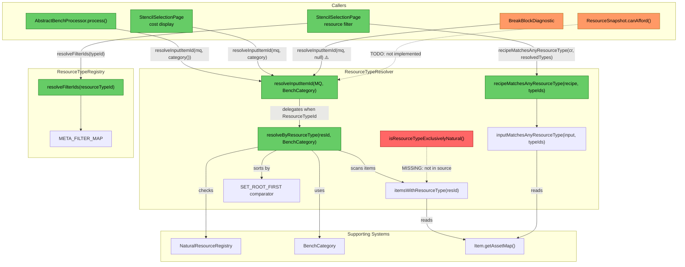
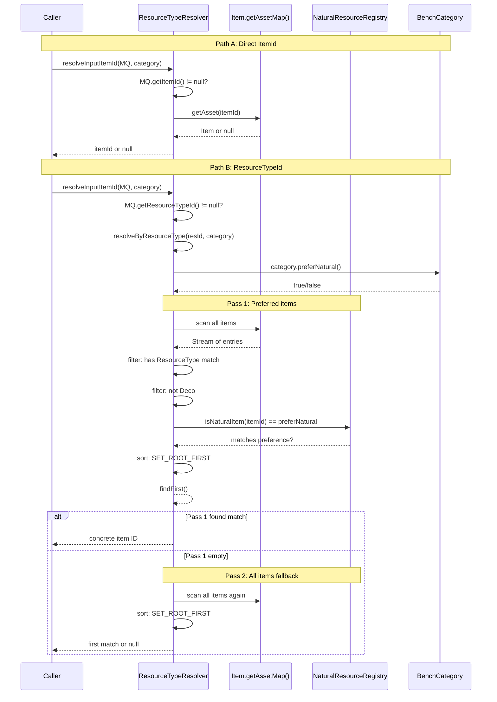

# Review: Root Resource Resolution System

**Date:** 2025-05-06
**Scope:** `ResourceTypeResolver`, `ResourceTypeRegistry`, and all consumers
**Depth:** Deep dive — full findings table, sequence diagrams, and data flow analysis

---

## 1. Executive Summary

The root resource resolution system is architecturally sound in its core design — a stateless, two-pass resolver with bench-category-aware preference and set-root tie-breaking. However, there is a **critical gap**: the `isResourceTypeExclusivelyNatural()` method exists in tests and design documents but is **missing from the source**, meaning the test suite cannot compile. A secondary concern is a **null-safety bug** in `BreakBlockDiagnostic` which passes `null` as the `BenchCategory`, risking an NPE on ResourceTypeId-based inputs. The highest-impact fix is implementing the missing classification method so the base-block classifier can correctly distinguish natural vs. crafted blocks when recipe inputs use `ResourceTypeId`.

---

## 2. Current Architecture Diagram



---

## 3. Findings Table

| # | Category | Severity | Location | Detail |
|---|----------|----------|----------|--------|
| 1 | Anti-pattern | 🔴 **Blocked** | [ResourceTypeResolver.java](../src/main/java/com/UnobstructedThirdPerson/resourcecollection/ResourceTypeResolver.java) (entire file) | `isResourceTypeExclusivelyNatural()` method is referenced in 5 test cases ([ResourceTypeResolverTest.java](../src/test/java/com/UnobstructedThirdPerson/resourcecollection/ResourceTypeResolverTest.java#L287-L345)) and 2 design documents but **does not exist in source**. Tests cannot compile. This method is needed for base-block classification — determining whether all items matching a ResourceTypeId are natural, distinct from the drop-resolution concern. |
| 2 | Anti-pattern | 🟡 **Should Fix** | [BreakBlockDiagnostic.java](../src/main/java/com/UnobstructedThirdPerson/resourcecollection/BreakBlockDiagnostic.java#L96) | Passes `null` for `BenchCategory` to `resolveInputItemId()`. If the MaterialQuantity has a ResourceTypeId (no direct ItemId), `resolveByResourceType()` calls `category.preferNatural()` which throws NPE. |
| 3 | Anti-pattern | 🟡 **Should Fix** | [ResourceTypeResolver.java](../src/main/java/com/UnobstructedThirdPerson/resourcecollection/ResourceTypeResolver.java#L43-L50) | Uses `java.lang.reflect.Field` to read the private `Item.set` field. Fragile — breaks silently if the engine renames/removes the field. The `ExceptionInInitializerError` in the static block will crash the entire class loading. |
| 4 | Scalability | 🟠 **QA** | [ResourceTypeResolver.java](../src/main/java/com/UnobstructedThirdPerson/resourcecollection/ResourceTypeResolver.java#L112-L130) | `resolveByResourceType()` does a **full scan of the entire item asset map** on every call (twice in the worst case — pass 1 fails, pass 2 runs). With ~5000+ items in the asset map, each `AbstractBenchProcessor.process()` invocation calls this for every input of every recipe. No caching of results. |
| 5 | Redundancy | 🟠 **QA** | [StencilSelectionPage.java](../src/main/java/com/UnobstructedThirdPerson/placeblock/ui/StencilSelectionPage.java#L821) + [AbstractBenchProcessor.java](../src/main/java/com/UnobstructedThirdPerson/resourcecollection/AbstractBenchProcessor.java#L65-L67) | Identical 3-line pattern duplicated in two places: `resolveInputItemId(mq, category)` → null check → `resolveToGatherableForm(itemId)`. These two call sites do the same composition of resolver + gatherable-form normalization. |
| 6 | Over-engineering | 🔵 **Review** | [ResourceSnapshot.java](../src/main/java/com/UnobstructedThirdPerson/placeblock/ResourceSnapshot.java#L62-L66) | `canAfford()` has a TODO referencing ResourceTypeResolver but is not implemented (returns `false`). Dead code path — if nothing calls it yet, consider removing or implementing. |
| 7 | Redundancy | 🔵 **Review** | [ResourceTypeRegistry.java](../src/main/java/com/UnobstructedThirdPerson/placeblock/ui/ResourceTypeRegistry.java#L229) vs [ResourceTypeResolver.java](../src/main/java/com/UnobstructedThirdPerson/resourcecollection/ResourceTypeResolver.java#L110) | Two separate "resolve" concepts on the same domain: `ResourceTypeRegistry.resolveFilterIds()` expands UI filter → set of ResourceTypeIds; `ResourceTypeResolver.resolveByResourceType()` resolves ResourceTypeId → concrete item. Names could be confused. They compose correctly in series but should be understood as distinct operations. |

---

## 4. Methods Found — Exact Signatures

### ResourceTypeResolver — Public API

| Method | Line | Signature | Purpose |
|--------|------|-----------|---------|
| `resolveInputItemId` | [L76](../src/main/java/com/UnobstructedThirdPerson/resourcecollection/ResourceTypeResolver.java#L76) | `@Nullable static String resolveInputItemId(@Nonnull MaterialQuantity, @Nonnull BenchCategory)` | Entry point: MQ → concrete item ID |
| `resolveByResourceType` | [L110](../src/main/java/com/UnobstructedThirdPerson/resourcecollection/ResourceTypeResolver.java#L110) | `@Nullable static String resolveByResourceType(@Nonnull String, @Nonnull BenchCategory)` | Core: ResourceTypeId → concrete item ID via two-pass scan |
| `recipeMatchesAnyResourceType` | [L220](../src/main/java/com/UnobstructedThirdPerson/resourcecollection/ResourceTypeResolver.java#L220) | `static boolean recipeMatchesAnyResourceType(@Nonnull CraftingRecipe, @Nonnull Set<String>)` | Filter predicate: does recipe use any of these resource types? |
| `isDeco` | [L148](../src/main/java/com/UnobstructedThirdPerson/resourcecollection/ResourceTypeResolver.java#L148) | `static boolean isDeco(@Nonnull Item)` | Package-private: is item in Blocks.Deco category? |
| `isResourceTypeExclusivelyNatural` | **MISSING** | `static boolean isResourceTypeExclusivelyNatural(String resId, Set<String> naturalItems)` | **Not implemented** — needed for base-block classification |

### ResourceTypeRegistry — Public API

| Method | Line | Signature | Purpose |
|--------|------|-----------|---------|
| `resolveFilterIds` | [L229](../src/main/java/com/UnobstructedThirdPerson/placeblock/ui/ResourceTypeRegistry.java#L229) | `static Set<String> resolveFilterIds(String resourceTypeId)` | Expand meta-filter group → set of engine ResourceTypeIds |
| `isMetaFilter` | [L244](../src/main/java/com/UnobstructedThirdPerson/placeblock/ui/ResourceTypeRegistry.java#L244) | `static boolean isMetaFilter(String resourceTypeId)` | Is this a group meta-filter entry? |

---

## 5. Resolution Flow



### Set-Root Priority

Within each pass, items are sorted by a comparator (`SET_ROOT_FIRST`) that puts "set root" items before derivatives:

- **Set root**: item whose ID equals its `set` field (e.g. `Wood_Hardwood_Planks` with `set="Wood_Hardwood_Planks"`)
- **Derivative**: item whose `set` points to a different item (e.g. `Wood_Hardwood_Decorative` with `set="Wood_Hardwood_Planks"`)

This ensures that when multiple items share a ResourceTypeId (like `"Wood_Hardwood"`), the "base" item in the family is preferred. Example:

| Item ID | Set | isSetRoot | ResourceTypes |
|---------|-----|-----------|---------------|
| `Wood_Hardwood_Planks` | `Wood_Hardwood_Planks` | ✅ Yes | `Wood_Planks`, `Wood_Hardwood` |
| `Wood_Hardwood_Decorative` | `Wood_Hardwood_Planks` | ❌ No | `Wood_Hardwood` |
| `Wood_Hardwood_Ornate` | `Wood_Hardwood_Planks` | ❌ No | `Wood_Hardwood` |
| `Wood_Log_Oak` | `Wood_Oak` | ❌ No | `Wood_All`, `Wood_Hardwood`, `Wood_Trunk`, `Fuel` |

For `resolveByResourceType("Wood_Hardwood", BUILDERS_ONLY)`:
- **Pass 1** (non-natural): `Planks` (root), `Decorative`, `Ornate` → picks **Planks**
- For `FURNITURE_ONLY`: Pass 1 (natural) → `Wood_Log_Oak` → picks **Log**

---

## 6. All Callers

### 6.1 `resolveInputItemId` — 3 production callers

| # | Caller | File | Line | Category Passed | Post-Processing | Purpose |
|---|--------|------|------|-----------------|-----------------|---------|
| 1 | `AbstractBenchProcessor.process()` | [AbstractBenchProcessor.java](../src/main/java/com/UnobstructedThirdPerson/resourcecollection/AbstractBenchProcessor.java#L65) | 65 | `category()` (from subclass) | `resolveToGatherableForm()` | **Drop scaling**: determines what items to put in synthetic drop lists when breaking recipe blocks |
| 2 | `StencilSelectionPage` (cost grid) | [StencilSelectionPage.java](../src/main/java/com/UnobstructedThirdPerson/placeblock/ui/StencilSelectionPage.java#L821) | 821 | From `RecipeFilterRegistry.getEntry()` | `resolveToGatherableForm()` | **UI cost display**: resolves inputs to show ingredient icons and quantities |
| 3 | `BreakBlockDiagnostic` | [BreakBlockDiagnostic.java](../src/main/java/com/UnobstructedThirdPerson/resourcecollection/BreakBlockDiagnostic.java#L96) | 96 | **`null`** ⚠️ | None | **Debug logging**: shows resolved items when a block is broken |

### 6.2 `recipeMatchesAnyResourceType` — 1 production caller

| # | Caller | File | Line | Purpose |
|---|--------|------|------|---------|
| 1 | `StencilSelectionPage` (resource filter) | [StencilSelectionPage.java](../src/main/java/com/UnobstructedThirdPerson/placeblock/ui/StencilSelectionPage.java#L225) | 225 | Filters recipe grid by selected resource types in RESOURCE_DRIVEN mode |

### 6.3 `resolveByResourceType` — 0 direct production callers

Only called internally by `resolveInputItemId`. Package-private visibility.

### 6.4 `isResourceTypeExclusivelyNatural` — 0 callers (method missing)

Referenced in:
- [ResourceTypeResolverTest.java](../src/test/java/com/UnobstructedThirdPerson/resourcecollection/ResourceTypeResolverTest.java#L287-L345) — 5 test cases
- Design docs: `fix-bench-specific-resolution.md`, `fix-base-block-misclassification.md`, `crafting-costs.md`

### 6.5 `ResourceSnapshot.canAfford()` — TODO stub

[ResourceSnapshot.java](../src/main/java/com/UnobstructedThirdPerson/placeblock/ResourceSnapshot.java#L62) has a comment referencing ResourceTypeResolver but returns `false`. Not connected.

---

## 7. Overlap: ResourceTypeResolver vs ResourceTypeRegistry

These are **complementary, not overlapping** systems. They resolve in opposite directions and compose in series:

```
User clicks "Hardwood" filter button
        ↓
ResourceTypeRegistry.resolveFilterIds("Hardwood")
        ↓  returns Set.of("Hardwood")
        ↓  (or for "Rock_Group" → Set.of("Rock", "Clays", "Sands", ...))
        ↓
ResourceTypeResolver.recipeMatchesAnyResourceType(recipe, resolvedTypeIds)
        ↓  checks if any recipe input's ResourceTypeId ∈ resolvedTypeIds
        ↓  OR if any input's Item declares a matching ResourceType
        ↓
boolean: recipe should appear in filtered grid
```

**Key distinction:**

| | ResourceTypeRegistry | ResourceTypeResolver |
|---|---|---|
| **Domain** | UI filter layer | Item resolution layer |
| **Direction** | Filter button → ResourceTypeId set | ResourceTypeId → concrete item |
| **Data source** | Hardcoded registry (73 entries + 7 meta-groups) | Engine's `Item.getAssetMap()` (runtime scan) |
| **Mutability** | Immutable after class load | Stateless (reads immutable post-init data) |
| **Purpose** | "What resource types does this filter cover?" | "What concrete item satisfies this resource type?" |

The grid's `ResourceTypeEntry` entries are a UI-curated subset. They don't represent the full set of engine ResourceTypeIds — they're the ones deemed useful for player-facing filtering.

---

## 8. Impact Assessment

### If `resolveByResourceType()` changes:

| Component | Impact | Reason |
|-----------|--------|--------|
| `AbstractBenchProcessor` | **High** — drop items change | All synthetic drop lists recalculated; wrong resolution = wrong drops |
| `StencilSelectionPage` (cost grid) | **Medium** — cost icons change | UI shows different ingredient icons, player may see incorrect affordability |
| `BreakBlockDiagnostic` | **Low** — diagnostic only | Only affects debug output |
| Tests | **Must update** | 20+ test cases exercise `resolveByResourceType` directly |

### If `resolveInputItemId()` changes:

Same as above plus: affects the null/Empty ItemId handling path, which all three callers depend on.

### If `recipeMatchesAnyResourceType()` changes:

Only `StencilSelectionPage` resource filter affected. Lower blast radius.

### If `itemsWithResourceType()` changes:

All three public methods depend on it. This is the foundational stream — any change here propagates to every consumer.

---

## 9. Observations

### 9.1 Missing `isResourceTypeExclusivelyNatural` — Root Cause

The design documents ([fix-bench-specific-resolution.md](../docs/Plans/fix-bench-specific-resolution.md), [fix-base-block-misclassification.md](../docs/Plans/fix-base-block-misclassification.md)) describe this method as essential for separating **drop resolution** (which item to drop, bench-preference-aware) from **base-block classification** (whether a recipe's inputs are exclusively natural). The tests were written ahead of implementation. The method would use the existing `itemsWithResourceType()` stream and check whether ALL matching items are in a provided `naturalItems` set.

### 9.2 Reflection on `Item.set` Field

The `SET_FIELD` reflection access in `ResourceTypeResolver` is the only way to read the `set` field because Hytale's `Item` class doesn't expose a public getter. This is acceptable as a workaround for an engine limitation, but the `ExceptionInInitializerError` in the static block makes the entire class unusable if the field is ever renamed. Consider wrapping with a graceful fallback.

### 9.3 No Caching

`resolveByResourceType()` performs a full asset map scan on every call. During `AbstractBenchProcessor.process()`, this is called for every input of every recipe across hundreds of blocks. The asset map is immutable post-init, so results could be cached in a `Map<String+BenchCategory, String>` built once during init. However, the current approach appears performant enough (init-time only).

### 9.4 Composition Pattern

Both `AbstractBenchProcessor` and `StencilSelectionPage` follow the same composition:
```java
String itemId = ResourceTypeResolver.resolveInputItemId(mq, category);
if (itemId == null) continue;
itemId = NaturalResourceRegistry.resolveToGatherableForm(itemId);
```
This 3-line pattern could be a single `resolveAndNormalize()` method on `ResourceTypeResolver`, but it's only 2 call sites — not worth abstracting unless a third appears.

---

## 5. Migration Notes

- **Implement `isResourceTypeExclusivelyNatural()`** in `ResourceTypeResolver.java` — the existing `itemsWithResourceType()` stream provides the foundation; the method needs to check that ALL items in the stream are contained in the provided natural items set, with a non-vacuous guard (at least one item must match)
- **Fix `BreakBlockDiagnostic`** — pass a non-null `BenchCategory` (e.g. the category from `BenchRecipeRegistries.getRegistryForBlock()`, or a fallback like `BUILDERS_ONLY`) instead of `null`
- **`ResourceSnapshot.canAfford()`** — either implement the TODO or remove the dead method; it currently returns `false` unconditionally
- **No deletions needed** — the existing architecture is sound; the resolver and registry serve distinct roles
- **No ordering constraints change** — init order (`NaturalResourceRegistry.init()` → `RecipeFilterRegistry.init()` → `BenchRecipeRegistries.init()`) remains correct

---

→ @Engineer implement `isResourceTypeExclusivelyNatural()` and fix `BreakBlockDiagnostic` null category from `docs/review-root-resource-resolution.md`
