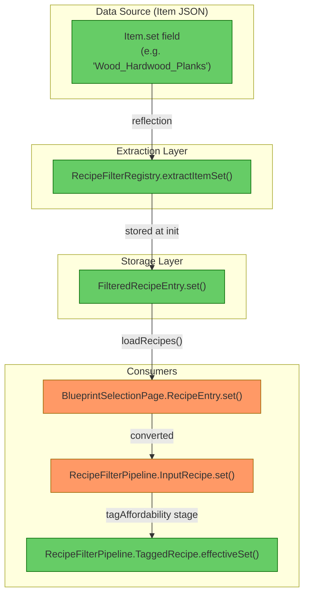
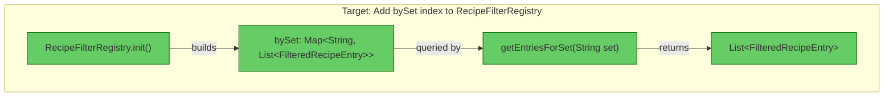

# Review: Set Resolution Architecture

## 1. Executive Summary

The set resolution system is **well-architected and nearly standalone**. The `Item.set` field is extracted once during `RecipeFilterRegistry.init()` via reflection and stored immutably on each `FilteredRecipeEntry`. The data is purely recipe-driven with no UI coupling. However, there is **no direct "by set" index** — getting all entries for a given set currently requires a full linear scan of `getAllEntries()`. Adding a `bySet` map (identical to the existing `byBenchId` pattern) would make the API directly reusable from the radial menu with zero UI dependencies.

## 2. Current Architecture Diagram



**Legend:**
- 🟢 Green — clean, portable, no coupling
- 🟠 Orange — redundant copy / UI-local struct with same data

## 3. Findings Table

| # | Category | Severity | Location | Detail |
|---|----------|----------|----------|--------|
| 1 | Redundancy | 🔵 Review | [RecipeFilterRegistry.java](../src/main/java/com/UnobstructedThirdPerson/resourcecollection/RecipeFilterRegistry.java#L66-L75) | `extractItemSet()` uses reflection on `Item.set` — this is the same pattern as `ResourceTypeResolver.getSetId()` (line 181). Two reflection handles for the same field. Not a bug, but a potential consolidation point. |
| 2 | Scalability | 🟡 Should Fix | [RecipeFilterRegistry.java](../src/main/java/com/UnobstructedThirdPerson/resourcecollection/RecipeFilterRegistry.java#L187-L197) | No `bySet` index exists. To get "all recipes in set X" a consumer must do `getAllEntries().stream().filter(e -> set.equals(e.set()))` — O(n) on every call. The `byBenchId` pattern already shows the correct approach. |
| 3 | Redundancy | 🔵 Review | [BlueprintSelectionPage.java](../src/main/java/com/UnobstructedThirdPerson/placeblock/ui/BlueprintSelectionPage.java#L1050-L1053) | `RecipeEntry` is a private record that duplicates fields already on `FilteredRecipeEntry` (recipeId, outputItemId, blockTypeId, set, categoryIds). The pipeline converts between them. Not blocking for radial menu reuse. |
| 4 | Anti-pattern | 🔵 Review | [RecipeFilterPipeline.java](../src/main/java/com/UnobstructedThirdPerson/placeblock/ui/RecipeFilterPipeline.java#L29-L30) | `UNCATEGORIZED_SET` constant lives in `RecipeFilterPipeline` (UI-adjacent). If the radial menu needs the same null-normalization, it would import a UI pipeline class. Consider moving to `RecipeFilterRegistry` or a shared constants class. |

## 4. Data Flow Analysis

### Q1: Where is set resolution logic?

| Step | Class | Method | Line |
|------|-------|--------|------|
| 1. Reflection extraction | `RecipeFilterRegistry` | `extractItemSet(Item)` | [L294](../src/main/java/com/UnobstructedThirdPerson/resourcecollection/RecipeFilterRegistry.java#L294) |
| 2. Storage on entry | `RecipeFilterRegistry` | `init(Set)` → builds `FilteredRecipeEntry` | [L150](../src/main/java/com/UnobstructedThirdPerson/resourcecollection/RecipeFilterRegistry.java#L150) |
| 3. Query by recipe ID | `RecipeFilterRegistry` | `getEntry(String)` | [L201](../src/main/java/com/UnobstructedThirdPerson/resourcecollection/RecipeFilterRegistry.java#L201) |

### Q2: Is it coupled?

**No.** `RecipeFilterRegistry` is:
- Static, singleton, no UI state
- Initialized once at asset-load time
- Exposes `getEntry(recipeId)` which returns `FilteredRecipeEntry` containing `.set()`
- No player reference, no page reference, no inventory needed

### Q3: Can it be called standalone?

**Yes — already.**

```java
// From any server-side code:
FilteredRecipeEntry entry = RecipeFilterRegistry.getEntry("Wood_Hardwood_Planks");
String setName = entry.set(); // → "Wood_Hardwood_Planks" (or null)
```

**What's missing:** A method to get all entries for a given set without scanning:

```java
// Does NOT exist yet:
List<FilteredRecipeEntry> siblings = RecipeFilterRegistry.getEntriesForSet("Wood_Hardwood_Planks");
```

### Q4: Full data flow for the radial menu

Given a stencil `ItemStack`:

```
1. StencilMetadata.getRecipeId(stack)          → "Wood_Hardwood_Planks"
2. RecipeFilterRegistry.getEntry(recipeId)     → FilteredRecipeEntry
3. entry.set()                                 → "Wood_Hardwood_Planks" (or null)
4. RecipeFilterRegistry.getEntriesForSet(set)  → [entry1, entry2, ...] ← NEEDS ADDING
5. entries.stream().map(e -> e.outputItemId()) → ["Wood_Hardwood_Planks", "Wood_Hardwood_Decorative", ...]
6. entries.stream().map(e -> e.recipeId())     → recipe IDs for each sibling
```

### Q5: Proposed call chain diagram

```mermaid
graph TB
    subgraph "Stencil Radial Menu - Proposed Flow"
        S1["StencilMetadata.getRecipeId(stack)"] -->|"recipeId"| S2
        S2["RecipeFilterRegistry.getEntry(recipeId)"] -->|"FilteredRecipeEntry"| S3
        S3["entry.set()"] -->|"set name e.g. 'Wood_Hardwood_Planks'"| S4
        S4["RecipeFilterRegistry.getAllEntries()<br/>.filter(e -> set.equals(e.set()))"] -->|"List of entries"| S5
        S5["entries.stream().map(e -> e.outputItemId())"] -->|"item IDs for radial"| S6
        S6["Populate radial menu slots"]
    end

    style S1 fill:#6c6,stroke:#060
    style S2 fill:#6c6,stroke:#060
    style S3 fill:#6c6,stroke:#060
    style S4 fill:#f96,stroke:#960
    style S5 fill:#6c6,stroke:#060
    style S6 fill:#6c6,stroke:#060
```



Node S4 (orange) = the linear scan that should become an indexed lookup.

## 5. Target Architecture Diagram



## 6. Recommendation

**Add a `bySet` index to `RecipeFilterRegistry`** — this follows the exact same pattern as the existing `byBenchId` map:

1. Add `private static Map<String, List<FilteredRecipeEntry>> bySet` field
2. Populate it during `init()` alongside `byBenchId`
3. Expose `public static List<FilteredRecipeEntry> getEntriesForSet(String set)`

**Estimated change:** ~15 lines in `RecipeFilterRegistry.java`. Zero changes to `RecipeFilterPipeline`, `BlueprintSelectionPage`, or any other file.

**Radial menu integration** then becomes:

```java
String recipeId = StencilMetadata.getRecipeId(activeStencilStack);
FilteredRecipeEntry entry = RecipeFilterRegistry.getEntry(recipeId);
if (entry != null && entry.set() != null) {
    List<FilteredRecipeEntry> siblings = RecipeFilterRegistry.getEntriesForSet(entry.set());
    // → populate radial slots with siblings.stream().map(e -> e.outputItemId())
}
```

No utility extraction needed. The existing `RecipeFilterRegistry` is already the correct place; it just needs one more index and one more query method.

## 7. Migration Notes

- **Nothing to delete** — existing architecture is sound
- **Add:** `bySet` map + `getEntriesForSet()` to `RecipeFilterRegistry` (mirrors `byBenchId` pattern)
- **Optional consolidation:** Move `UNCATEGORIZED_SET` constant to `RecipeFilterRegistry` if the radial menu needs null-normalization
- **Optional consolidation:** Merge `ResourceTypeResolver.getSetId()` and `RecipeFilterRegistry.extractItemSet()` into a shared static (low priority, both work fine independently)
- **No ordering constraints** — `RecipeFilterRegistry.init()` already runs before any UI page; the radial menu can query it at any time after init

---

→ @Engineer implement `getEntriesForSet()` addition to `RecipeFilterRegistry` per this review
→ @Architect if the radial menu needs set-aware stencil switching beyond simple "siblings in same set"
