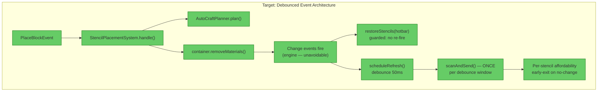
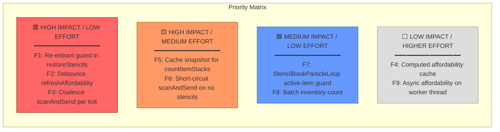

# Performance Architecture Review — Stencil Event Cascade & Inventory Change Listeners

**Date:** 2025-05-22  
**Scope:** StencilSyncSystem → StencilVisualManager → AutoCraftPlanner event cascade, StencilBookParticleLoop  
**Trigger:** Server-freezing lag during stencil block placement (server thread blocked)

---

## 1. Executive Summary

The stencil placement system has a **catastrophic synchronous event cascade** that multiplies the cost of every inventory change by 4–8×. A single block placement triggers `removeMaterials`, which fires change events on 3 sub-containers synchronously. Each event runs `restoreStencils` (which fires *another* event via `setItemStackForSlot`), and each event invocation runs `refreshAffordability` → `scanAndSend` → `AutoCraftPlanner.plan()` for **every stencil in the hotbar**. With 8 stencils and 2 ingredients each, a single block placement executes **128–256 linear inventory scans** on the server thread inside a single tick. This is the primary cause of the server freeze.

**Dominant problem:** Unguarded re-entrant synchronous event dispatch with O(S×I) inventory scans per invocation (S=stencils, I=ingredients), invoked 4–5× per placement event.

**Highest-impact fix:** Add a re-entrancy guard + debounce to `refreshAffordability` — eliminates 75–80% of the computation with a 3-line change.

---

## 2. Cascade Analysis

### Trace: Single Block Placement via Stencil

**Assumptions:** Player has 8 stencils in hotbar, each recipe has 2 ingredients. Combined inventory has ~50 slots (hotbar 9 + backpack 27 + storage ~15).

#### Step-by-step cascade:

| Step | Action | Invocation count | Cost per invocation |
|------|--------|-----------------|-------------------|
| 1 | `StencilPlacementSystem.handle()` | 1 | — |
| 2 | `AutoCraftPlanner.plan()` (pre-check) | 1 | 2× `countItemStacks` (fast path) or 4×+ (slow path) |
| 3 | `container.removeMaterials()` | 1 | Engine removes items |
| 4 | `CombinedItemContainer.sendUpdate()` | 1 | Dispatches to sub-containers |
| 5a | `hotbar.sendUpdate()` → fires change event | 1 | — |
| 5b | → `restoreStencils(hotbar)` | 1 | Scans 9 slots, finds stencil at qty 1, calls `setItemStackForSlot()` |
| 5c | → `setItemStackForSlot()` fires ANOTHER change event | 1 | — |
| 5d | → `restoreStencils()` again (harmless — qty=2 now) | 1 | Scans 9 slots, no-ops |
| 5e | → `refreshAffordability()` #2 (from re-entrant event) | 1 | **8 stencils × plan() each** |
| 5f | → `refreshAffordability()` #1 (from original event) | 1 | **8 stencils × plan() each** |
| 6 | `backpack.sendUpdate()` → fires change event | 1 | — |
| 6a | → `refreshAffordability()` #3 | 1 | **8 stencils × plan() each** |
| 7 | `storage.sendUpdate()` → fires change event | 1 | — |
| 7a | → `refreshAffordability()` #4 | 1 | **8 stencils × plan() each** |
| 8 | Engine's native `removeItemStackFromSlot()` on stencil | 1 | Fires ANOTHER hotbar change event |
| 8a | → `restoreStencils()` (restores qty 2) | 1 | `setItemStackForSlot()` fires event |
| 8b | → `refreshAffordability()` #5 + #6 | 2 | **8 stencils × plan() each** |

#### Total per single block placement:

| Metric | Count |
|--------|-------|
| `refreshAffordability()` invocations | **5–6** |
| `scanAndSend()` invocations | **5–6** |
| `AutoCraftPlanner.plan()` invocations | **40–48** (5–6 × 8 stencils) |
| `countItemStacks()` linear scans | **128–256** (fast path: 2 per plan × 48 plans; slow path: up to 5 per plan) |
| Slots scanned total | **6,400–12,800** (128–256 × 50 slots) |
| All of this on | **server thread, synchronous, single tick** |

```mermaid
graph TB
    subgraph "Single Block Placement Event Cascade"
        A["PlaceBlockEvent<br/>(engine)"] --> B["StencilPlacementSystem.handle()"]
        B --> C["AutoCraftPlanner.plan()<br/>🔴 Full affordability check"]
        B --> D["container.removeMaterials()<br/>acquires write locks"]
        D --> E["CombinedItemContainer.sendUpdate()"]
        E --> F["hotbar.sendUpdate()<br/>🔴 fires change event"]
        E --> G["backpack.sendUpdate()<br/>🔴 fires change event"]
        E --> H["storage.sendUpdate()<br/>🔴 fires change event"]
        F --> I["restoreStencils(hotbar)"]
        I --> J["setItemStackForSlot()<br/>🔴 fires ANOTHER change event"]
        J --> K["restoreStencils again<br/>(harmless — qty=2, skip)"]
        J --> L["refreshAffordability #2<br/>🔴 REDUNDANT"]
        F --> M["refreshAffordability #1<br/>🔴 EXPENSIVE"]
        G --> N["refreshAffordability #3<br/>🔴 REDUNDANT"]
        H --> O["refreshAffordability #4<br/>🔴 REDUNDANT"]
        M --> P["scanAndSend()"]
        L --> Q["scanAndSend()"]
        N --> R["scanAndSend()"]
        O --> S["scanAndSend()"]
        P --> T["AutoCraftPlanner.plan()<br/>per stencil × N"]
        Q --> U["AutoCraftPlanner.plan()<br/>per stencil × N"]
        R --> V["AutoCraftPlanner.plan()<br/>per stencil × N"]
        S --> W["AutoCraftPlanner.plan()<br/>per stencil × N"]
    end

    style A fill:#6c6,stroke:#060
    style B fill:#6c6,stroke:#060
    style C fill:#f96,stroke:#960
    style D fill:#f96,stroke:#960
    style E fill:#f66,stroke:#900
    style F fill:#f66,stroke:#900
    style G fill:#f66,stroke:#900
    style H fill:#f66,stroke:#900
    style I fill:#f96,stroke:#960
    style J fill:#f66,stroke:#900
    style K fill:#6c6,stroke:#060
    style L fill:#f66,stroke:#900
    style M fill:#f66,stroke:#900
    style N fill:#f66,stroke:#900
    style O fill:#f66,stroke:#900
    style P fill:#f66,stroke:#900
    style Q fill:#f66,stroke:#900
    style R fill:#f66,stroke:#900
    style S fill:#f66,stroke:#900
    style T fill:#f66,stroke:#900
    style U fill:#f66,stroke:#900
    style V fill:#f66,stroke:#900
    style W fill:#f66,stroke:#900
```

---

## 3. Findings

| # | Category | Severity | Location | Detail |
|---|----------|----------|----------|--------|
| F1 | Anti-pattern | 🔴 Critical | [StencilSyncSystem.java](src/main/java/com/CodeCreature/stencil/StencilSyncSystem.java#L86-L92) | **Re-entrant event cascade.** `restoreStencils()` calls `hotbar.setItemStackForSlot()` inside the hotbar change event handler. The engine's `sendUpdate()` ([ItemContainer.java](.tmp_hytale_src/com/hypixel/hytale/server/core/inventory/container/ItemContainer.java#L1319-L1324)) fires change events synchronously via `SyncEventBusRegistry`, causing re-entrant invocation of the same handler. Each re-entry triggers another full `refreshAffordability` cycle. |
| F2 | Anti-pattern | 🔴 Critical | [StencilSyncSystem.java](src/main/java/com/CodeCreature/stencil/StencilSyncSystem.java#L48-L60) | **No debounce / coalescing.** Three separate containers (hotbar, backpack, storage) each independently trigger `refreshAffordability`. A single `removeMaterials` on `CombinedItemContainer` fires `sendUpdate` on ALL sub-containers ([CombinedItemContainer.java](.tmp_hytale_src/com/hypixel/hytale/server/core/inventory/container/CombinedItemContainer.java#L243-L260)), causing 3 independent `refreshAffordability` calls that all compute the same result. |
| F3 | Scalability | 🔴 Critical | [StencilVisualManager.java](src/main/java/com/CodeCreature/stencil/StencilVisualManager.java#L213-L250) | **O(S × I × C) per event.** `scanAndSend()` loops over all stencils (S), calls `AutoCraftPlanner.plan()` per stencil, which calls `countItemStacks()` per ingredient (I), each scanning all combined container slots (C). With S=8, I=2, C=50, that's 800 slot reads per `scanAndSend()`. With 5× event multiplier from F1+F2, that's **4,000+ slot reads per placement.** |
| F4 | Redundancy | 🟡 High | [AutoCraftPlanner.java](src/main/java/com/CodeCreature/crafting/AutoCraftPlanner.java#L108-L140) | **Redundant inventory counts in AutoCraftPlanner.plan().** The fast path (step 2) counts every ingredient via `countItemStacks`, then if it fails, the slow path (step 3) counts them ALL AGAIN. Step 4 then counts them A THIRD TIME for verification. Three full scans when two would suffice. |
| F5 | Redundancy | 🟡 High | [RecipeAffordabilityResolver.java](src/main/java/com/CodeCreature/crafting/RecipeAffordabilityResolver.java#L160-L165) | **`isAffordableWithAutoCraft` calls `AutoCraftPlanner.plan()` which internally calls `resolveIngredientCosts()`.** But `plan()` also redundantly calls `PlaceBlockCostUtil.getPerUnitCost()` (array clone) and `resolveIngredientCosts()` — the resolve is performed twice: once for `directView` and once for the fast-path check. The `directView` result is never used when called from `isAffordableWithAutoCraft`. |
| F6 | Anti-pattern | 🟡 High | [StencilVisualManager.java](src/main/java/com/CodeCreature/stencil/StencilVisualManager.java#L213-L220) | **No early exit for zero stencils.** `scanAndSend()` always iterates the full hotbar and builds `currentStencils`/`changedItems` maps even if the player has no stencils in the hotbar. For non-stencil players who still have registered listeners, this is wasted work on every inventory change. |
| F7 | Scalability | 🟠 Medium | [StencilBookParticleLoop.java](src/main/java/com/CodeCreature/ui/stencilbook/StencilBookParticleLoop.java#L93-L100) | **Unconditional 100ms timer per player.** The scheduled task runs every 100ms for every player who has ever held a stencil book, doing `world.execute()` + ECS lookups + raycast even when the player is not holding the book. The `holdingBook` check exits early but the scheduler, `world.execute()` dispatch, and ECS ref lookup still happen. This is 10 world-thread dispatches/second per player. |
| F8 | Over-engineering | 🟠 Medium | [AutoCraftPlanner.java](src/main/java/com/CodeCreature/crafting/AutoCraftPlanner.java#L108-L112) | **`resolveIngredientCosts()` called eagerly for display data.** `plan()` computes `directView` and `rawView` on every call, but when called from `isAffordableWithAutoCraft()`, neither is used — only `affordable()` is checked. The display data computation includes `PlaceBlockCostUtil.getPerUnitCost()` (array clone), `resolveIngredientCosts()` (full resolution + N inventory counts), and `resolveRecipeToRaw()`. |
| F9 | Anti-pattern | 🔵 Low | [StencilSyncSystem.java](src/main/java/com/CodeCreature/stencil/StencilSyncSystem.java#L33) | **`ConcurrentHashMap` for single-threaded access.** `registeredPlayers` uses `ConcurrentHashMap` but `register`/`unregister` are called only from the server thread. The CHM adds unnecessary CAS overhead on every `containsKey`/`put`/`remove`. Minor, but symptomatic. |
| F10 | Anti-pattern | 🔵 Low | [AutoCraftPlanner.java](src/main/java/com/CodeCreature/crafting/AutoCraftPlanner.java#L130-L138) | **Lambda allocation per `countItemStacks` call.** Each `countItemStacks(stack -> lookupId.equals(...) && !StencilMetadata.isStencil(stack))` allocates a new lambda capturing `lookupId`. With 128+ calls per placement, this generates significant short-lived garbage on the server thread. |

---

## 4. Target Architecture

### Key differences from current:
1. **`restoreStencils` uses a re-entrancy guard** — `boolean isRestoring` flag prevents `setItemStackForSlot` from re-triggering the handler
2. **`refreshAffordability` is debounced** — all 3 container change events schedule a single deferred `scanAndSend()` rather than running inline. A `dirty` flag + `world.execute()` ensures exactly one scan per tick
3. **`AutoCraftPlanner.plan()` has a `boolean affordabilityOnly` parameter** — when true, skips `directView`/`rawView` computation
4. **Inventory counts are batched** — one pass over all slots, counting all needed item IDs simultaneously

---

## 5. Priority Matrix

### Recommended implementation order:

| Wave | Fixes | Expected reduction | Effort |
|------|-------|-------------------|--------|
| **Wave 1** | F1 (re-entrancy guard) + F2 (debounce) | ~80% of cascade eliminated | ~30 lines changed |
| **Wave 2** | F8 (skip directView/rawView in affordability-only path) + F6 (zero-stencil early exit) | ~50% of remaining cost | ~20 lines changed |
| **Wave 3** | F4 (batch counting) + F7 (particle loop guard) | Polish | ~40 lines changed |

---

## 6. Suggested Fix Directions

### F1 + F2: Re-entrancy guard + debounce (Wave 1)

**In `StencilSyncSystem`:**
- Add a `private static final Set<UUID> refreshPending` or per-player `AtomicBoolean` flag
- In `restoreStencils()`: set a `boolean isRestoring` ThreadLocal or static flag. Check it at the top of the change event handler to skip re-entrant calls
- In all three change event handlers: instead of calling `refreshAffordability()` directly, set a `dirty` flag and schedule `world.execute(() -> { if (dirty.getAndSet(false)) scanAndSend(...) })` — coalesces multiple change events in the same tick into one scan

**Estimated cascade reduction:** From 5–6 `scanAndSend()` calls → 1.

### F8: Affordability-only plan() (Wave 2)

**In `AutoCraftPlanner.plan()`:**
- Add an overload `planAffordabilityOnly(recipe, category, container)` that skips `resolveIngredientCosts()` and `resolveRecipeToRaw()` — these are only needed for UI display, not for the `isAffordableWithAutoCraft()` boolean check

**Estimated cost reduction:** Eliminates 1 `PlaceBlockCostUtil.getPerUnitCost()` clone + 1 full `resolveIngredientCosts()` pass (N inventory counts) per `plan()` call.

### F4: Batch counting (Wave 3)

**In `AutoCraftPlanner`:**
- Before the per-ingredient loop, do ONE pass over all container slots building a `Map<String, Integer>` of non-stencil item counts
- Use the pre-built map instead of N × `countItemStacks()` calls

**Estimated cost reduction:** From O(I × C) to O(C + I) per plan.

---

## 7. Open Questions

| # | Question | Impact | Who can verify |
|---|----------|--------|---------------|
| Q1 | Does `SyncEventBusRegistry.dispatch()` guarantee in-order delivery, or can events interleave on the same thread? | Affects whether re-entrancy guard needs to be a counter vs. boolean | Engine team / decompiled source |
| Q2 | Does `CombinedItemContainer.sendUpdate()` fire sub-container events while still holding the write lock? If yes, `countItemStacks()` (which acquires a read lock) inside the event handler may deadlock or rely on re-entrant locking. | Could explain intermittent freezes vs. consistent freezes | Engine team — check lock implementation (`readAction`/`writeAction`) |
| Q3 | Does the engine's native block placement (`removeItemStackFromSlot` on the stencil stack) fire a hotbar change event BEFORE or AFTER `StencilPlacementSystem.handle()` returns? | Determines whether the engine adds a 6th `refreshAffordability` call | Test empirically with logging |
| Q4 | Is `world.execute()` synchronous when called from the world thread? If so, the StencilBookParticleLoop's `scheduleAtFixedRate` → `world.execute()` may queue work that competes with event handlers. | Affects whether particle loop contributes to placement lag | Engine team |
| Q5 | Can `registerChangeEvent` accept a priority so the stencil restore handler runs LAST, after the engine's own internal handlers? | Would allow more predictable event ordering | API check — `EventPriority.LAST` exists in engine |

---

## 8. Multiplayer Amplification

The cascade analysis above is **per player, per placement**. In a multiplayer scenario:

- If 5 players are placing stencil blocks simultaneously, the server thread processes 5 cascades serially
- Each cascade blocks the server thread for the duration of all synchronous `scanAndSend()` calls
- Combined: **32,000–64,000 slot reads per tick** with 5 active stencil users
- This explains why "players cannot break or place blocks" — the server tick is overrun

---

→ @Engineer implement fixes from Wave 1 (F1 re-entrancy guard + F2 debounce) — these are the critical-path changes
→ @Architect if Q2 (lock re-entrancy under `sendUpdate`) confirms potential deadlock, this needs a design revision before Wave 1
