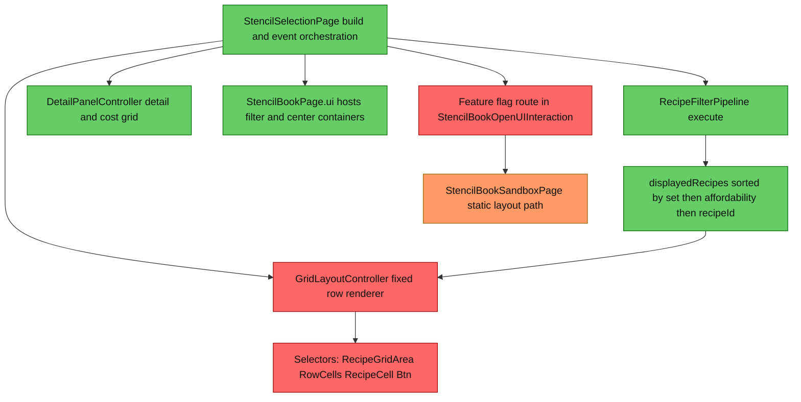
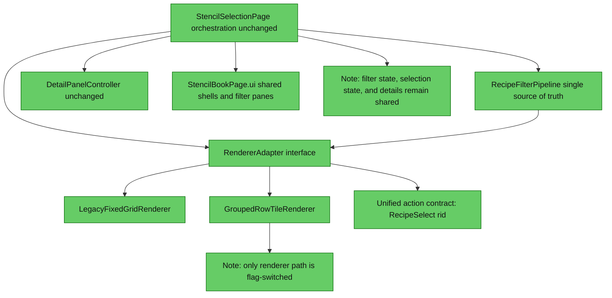

# Stencil UI Migration Review (Fixed Grid to Row/Group/Tile)

## 1. Executive Summary
The migration is feasible, but parity risk is currently dominated by selector-schema mismatch between production grid bindings and sandbox/group-tile components. The highest-impact change is to introduce a renderer adapter seam inside the existing page orchestration so filtering, selection, details, and affordability logic remain single-sourced. Keep a dual-renderer feature flag inside the production page flow and preserve the current fixed grid path as a hard fallback during rollout.

## 2. Current Architecture Diagram

## 3. Findings Table
| # | Category | Severity | Location | Detail |
|---|---|---|---|---|
| 1 | Anti-pattern | 🔴 Blocked | [src/main/java/com/CodeCreature/ui/bench/GridLayoutController.java](src/main/java/com/CodeCreature/ui/bench/GridLayoutController.java#L41), [src/main/resources/Common/UI/Custom/Pages/StencilBook/Sandbox/Components/SandboxIconTile.ui](src/main/resources/Common/UI/Custom/Pages/StencilBook/Sandbox/Components/SandboxIconTile.ui#L13), [src/main/resources/Common/UI/Custom/Pages/StencilBook/Components/SetGroupContainer.ui](src/main/resources/Common/UI/Custom/Pages/StencilBook/Components/SetGroupContainer.ui#L10) | Production click bindings depend on RecipeCell/Btn/RecipeAction selectors, but sandbox and candidate grouped components expose TileBtn or CellBtn structures. Without a contract-normalized selector schema, RecipeSelect dispatch will silently fail. |
| 2 | Scalability | 🔴 Blocked | [src/main/java/com/CodeCreature/ui/bench/StencilSelectionPage.java](src/main/java/com/CodeCreature/ui/bench/StencilSelectionPage.java#L301), [src/main/java/com/CodeCreature/ui/bench/StencilSelectionPage.java](src/main/java/com/CodeCreature/ui/bench/StencilSelectionPage.java#L412), [src/main/resources/Common/UI/Custom/Pages/StencilBook/StencilBookPage.ui](src/main/resources/Common/UI/Custom/Pages/StencilBook/StencilBookPage.ui#L176) | The existing event/update loop assumes a preallocated fixed-index grid. Grouped row/group/tile rendering changes address depth and indexing shape, so one-time binding and subsequent update selectors must be abstracted behind a renderer contract or events/updates will drift. |
| 3 | Redundancy | 🟡 Should Fix | [src/main/java/com/CodeCreature/ui/bench/StencilBookOpenUIInteraction.java](src/main/java/com/CodeCreature/ui/bench/StencilBookOpenUIInteraction.java#L45), [src/main/java/com/CodeCreature/ui/bench/sandbox/StencilBookSandboxPage.java](src/main/java/com/CodeCreature/ui/bench/sandbox/StencilBookSandboxPage.java#L62), [src/main/java/com/CodeCreature/ui/bench/StencilSelectionPage.java](src/main/java/com/CodeCreature/ui/bench/StencilSelectionPage.java#L243) | Current feature flag gates entire page routing to a static sandbox route, not renderer selection inside production orchestration. That bypasses production behavior (filters/details/state) and is not a safe parity migration toggle. |
| 4 | Scalability | 🟡 Should Fix | [src/main/java/com/CodeCreature/ui/bench/StencilSelectionPage.java](src/main/java/com/CodeCreature/ui/bench/StencilSelectionPage.java#L269), [src/main/java/com/CodeCreature/ui/bench/RecipeFilterPipeline.java](src/main/java/com/CodeCreature/ui/bench/RecipeFilterPipeline.java#L435), [src/main/java/com/CodeCreature/ui/bench/GridLayoutController.java](src/main/java/com/CodeCreature/ui/bench/GridLayoutController.java#L54) | Parity depends on preserving pipeline output ordering and grouping semantics. The new renderer must consume displayedRecipes as authoritative sorted input and only change visual composition, not filtering/sort order, or set/category/search behavior will regress. |
| 5 | Anti-pattern | 🟡 Should Fix | [src/main/java/com/CodeCreature/ui/bench/StencilSelectionPage.java](src/main/java/com/CodeCreature/ui/bench/StencilSelectionPage.java#L536), [src/main/java/com/CodeCreature/ui/bench/GridLayoutController.java](src/main/java/com/CodeCreature/ui/bench/GridLayoutController.java#L114), [src/main/java/com/CodeCreature/ui/bench/DetailPanelController.java](src/main/java/com/CodeCreature/ui/bench/DetailPanelController.java#L116) | Affordability state is rendered in two places (tile dimming and detail panel state). If the new renderer does not mirror affordable flags exactly, users will see contradictory dim/highlight states across center and detail panels. |
| 6 | Over-engineering | 🟠 QA | [src/main/java/com/CodeCreature/ui/bench/StencilSelectionPage.java](src/main/java/com/CodeCreature/ui/bench/StencilSelectionPage.java#L301), [src/main/resources/Common/UI/Custom/Pages/StencilBook/Components](src/main/resources/Common/UI/Custom/Pages/StencilBook/Components), [src/main/resources/Common/UI/Custom/Pages/StencilBook](src/main/resources/Common/UI/Custom/Pages/StencilBook) | Production build appends RecipeGridRow.ui and LabelCell.ui but those files are not present in src resources, while alternate cell components exist in a different path/schema. This indicates unresolved resource contract drift that should be validated before migration rollout. |

## 4. Target Architecture Diagram

## 5. Migration Notes
- Delete entirely:
  - Page-route-level sandbox fallback for production migration decisions in [src/main/java/com/CodeCreature/ui/bench/StencilBookOpenUIInteraction.java](src/main/java/com/CodeCreature/ui/bench/StencilBookOpenUIInteraction.java#L45) as the primary rollout mechanism for renderer parity.
- Consolidate:
  - Center-area rendering behind one renderer adapter seam in [src/main/java/com/CodeCreature/ui/bench/StencilSelectionPage.java](src/main/java/com/CodeCreature/ui/bench/StencilSelectionPage.java#L243), replacing direct dependence on [src/main/java/com/CodeCreature/ui/bench/GridLayoutController.java](src/main/java/com/CodeCreature/ui/bench/GridLayoutController.java).
  - One action payload convention for tile clicks (RecipeSelect:rid:...) across legacy and grouped renderers.
- Ordering constraints eliminated:
  - Remove hard coupling to fixed row and fixed cell indexing for event selector construction in [src/main/java/com/CodeCreature/ui/bench/GridLayoutController.java](src/main/java/com/CodeCreature/ui/bench/GridLayoutController.java#L37).
  - Keep build-time preallocation only as renderer-internal concern, not page-level assumption.
- Runtime systems that become unnecessary:
  - Static sandbox page route as migration surrogate in [src/main/java/com/CodeCreature/ui/bench/sandbox/StencilBookSandboxPage.java](src/main/java/com/CodeCreature/ui/bench/sandbox/StencilBookSandboxPage.java).

## Parity Contract Checklist (Must Not Break)
- Auto population still occurs from registry-backed recipe load path in [src/main/java/com/CodeCreature/ui/bench/StencilSelectionPage.java](src/main/java/com/CodeCreature/ui/bench/StencilSelectionPage.java#L120).
- Tab/category/set/search filters still run only through pipeline execution in [src/main/java/com/CodeCreature/ui/bench/StencilSelectionPage.java](src/main/java/com/CodeCreature/ui/bench/StencilSelectionPage.java#L201) and [src/main/java/com/CodeCreature/ui/bench/RecipeFilterPipeline.java](src/main/java/com/CodeCreature/ui/bench/RecipeFilterPipeline.java#L179).
- Sorting contract remains set then affordability then recipeId from [src/main/java/com/CodeCreature/ui/bench/RecipeFilterPipeline.java](src/main/java/com/CodeCreature/ui/bench/RecipeFilterPipeline.java#L435).
- Selection contract remains action prefix RecipeSelect:rid: and visible-recipe validation in [src/main/java/com/CodeCreature/ui/bench/StencilSelectionPage.java](src/main/java/com/CodeCreature/ui/bench/StencilSelectionPage.java#L605).
- Details panel contract remains driven by selectedRecipeId and shared recipe list in [src/main/java/com/CodeCreature/ui/bench/DetailPanelController.java](src/main/java/com/CodeCreature/ui/bench/DetailPanelController.java#L53).
- Affordability dimming remains consistent between center tiles and details from [src/main/java/com/CodeCreature/ui/bench/GridLayoutController.java](src/main/java/com/CodeCreature/ui/bench/GridLayoutController.java#L114) and [src/main/java/com/CodeCreature/ui/bench/DetailPanelController.java](src/main/java/com/CodeCreature/ui/bench/DetailPanelController.java#L116).

## Rollout Guardrails And Sequence
1. Introduce a renderer feature flag inside production page build/update flow (not page-route swap).
2. Build both renderer implementations behind identical method contracts: buildBindings, updateUI, clearUI/dismiss behavior.
3. Keep pipeline, detail panel, and event handler state transitions untouched while only switching renderer implementation.
4. Run parity checks for each user action branch in handleDataEvent before enabling grouped renderer by default.
5. Stage rollout: internal flag off by default, targeted on for test accounts, then default-on with immediate legacy fallback retained.

## Integration Seams In StencilSelectionPage
- Build seam:
  - Renderer creation currently hardcoded at [src/main/java/com/CodeCreature/ui/bench/StencilSelectionPage.java](src/main/java/com/CodeCreature/ui/bench/StencilSelectionPage.java#L279).
  - Renderer-specific append/preallocation currently mixed into page build from [src/main/java/com/CodeCreature/ui/bench/StencilSelectionPage.java](src/main/java/com/CodeCreature/ui/bench/StencilSelectionPage.java#L300).
- Binding seam:
  - Grid-only binding hook at [src/main/java/com/CodeCreature/ui/bench/StencilSelectionPage.java](src/main/java/com/CodeCreature/ui/bench/StencilSelectionPage.java#L351).
- Update seam:
  - All event branches call renderer update directly (examples: [src/main/java/com/CodeCreature/ui/bench/StencilSelectionPage.java](src/main/java/com/CodeCreature/ui/bench/StencilSelectionPage.java#L438), [src/main/java/com/CodeCreature/ui/bench/StencilSelectionPage.java](src/main/java/com/CodeCreature/ui/bench/StencilSelectionPage.java#L549), [src/main/java/com/CodeCreature/ui/bench/StencilSelectionPage.java](src/main/java/com/CodeCreature/ui/bench/StencilSelectionPage.java#L618)).
- Dismiss seam:
  - Page-level row visibility reset is grid-shape specific at [src/main/java/com/CodeCreature/ui/bench/StencilSelectionPage.java](src/main/java/com/CodeCreature/ui/bench/StencilSelectionPage.java#L388).

## Selector, Path, And Event Pitfalls To Avoid
- Do not mix selector families:
  - Legacy expects RecipeGridArea RowCells RecipeCell Btn/RecipeAction from [src/main/java/com/CodeCreature/ui/bench/GridLayoutController.java](src/main/java/com/CodeCreature/ui/bench/GridLayoutController.java#L41).
  - Candidate grouped component documents GroupCells CellBtn from [src/main/resources/Common/UI/Custom/Pages/StencilBook/Components/SetGroupContainer.ui](src/main/resources/Common/UI/Custom/Pages/StencilBook/Components/SetGroupContainer.ui#L10).
  - Sandbox tile uses TileBtn and TileIcon from [src/main/resources/Common/UI/Custom/Pages/StencilBook/Sandbox/Components/SandboxIconTile.ui](src/main/resources/Common/UI/Custom/Pages/StencilBook/Sandbox/Components/SandboxIconTile.ui#L8).
- Keep action payload source explicit and writable in tile components; legacy binding reads action text from node path in [src/main/java/com/CodeCreature/ui/bench/GridLayoutController.java](src/main/java/com/CodeCreature/ui/bench/GridLayoutController.java#L42).
- Keep all UI paths rooted under Pages/StencilBook/... and verify resource existence before rollout; current append paths in [src/main/java/com/CodeCreature/ui/bench/StencilSelectionPage.java](src/main/java/com/CodeCreature/ui/bench/StencilSelectionPage.java#L301) reference files not found in src resources.
- Preserve center container target in [src/main/resources/Common/UI/Custom/Pages/StencilBook/StencilBookPage.ui](src/main/resources/Common/UI/Custom/Pages/StencilBook/StencilBookPage.ui#L176) so both renderers write into the same visual region.

## Validation Note
Mermaid syntax was written to be parser-safe, but automated validation with a dedicated mermaid-diagram-validator tool was not possible because that tool is not available in this environment.
