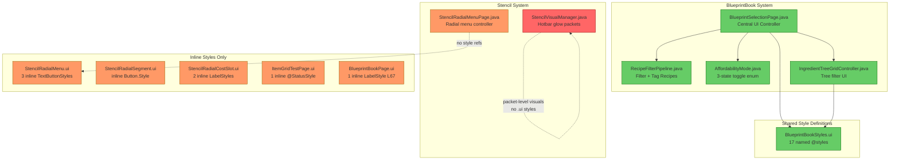
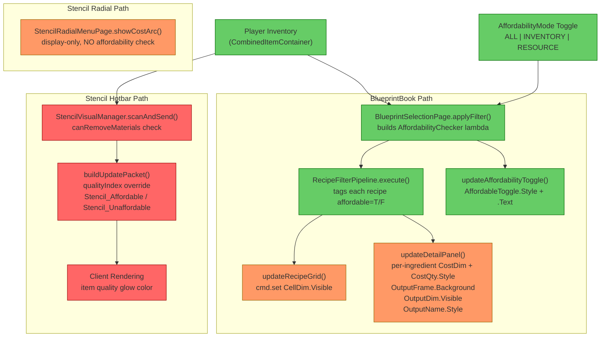

# UI Styling System Audit

## 1. Executive Summary

The BlueprintBook subsystem has a **well-centralized** style architecture: all 17 named styles live in a single shared file (`BlueprintBookStyles.ui`) and are referenced by both `.ui` templates and Java `Value.ref()` constants. The **StencilRadial subsystem is the opposite** — every style is defined inline with no shared file, producing duplicated `TextButtonStyle` and `LabelStyle` blocks across three `.ui` files. Additionally, `StencilVisualManager` uses an entirely separate visual channel (packet-level `qualityIndex` overrides) for affordability that shares no code or style tokens with the BlueprintBook system.

The highest-impact change is **extracting a `StencilRadialStyles.ui`** shared file and adding affordability checking to the radial menu's cost arc display.

---

## 2. Current Architecture Diagram

---

## 3. Style Definition Files

### 3A. Centralized Style File

| File | Styles Defined | Used By |
|------|---------------|---------|
| [BlueprintBookStyles.ui](../src/main/resources/Common/UI/Custom/Pages/BlueprintBook/BlueprintBookStyles.ui) | `@HeaderStyle`, `@DetailLabelStyle`, `@SubtextStyle`, `@SectionLabelStyle`, `@FilterActiveStyle`, `@FilterInactiveStyle`, `@SectionHeaderStyle`, `@WrapSecondaryButtonStyle`, `@TransparentButtonStyle`, `@EntryStyle`, `@SelectedEntryStyle`, `@UnaffordableEntryStyle`, `@SetGroupLabelStyle`, `@CostQuantityStyle`, `@EmptyStateStyle`, `@SelectedCellButtonStyle`, `@CostQuantityInsufficientStyle`, `@DetailLabelMutedStyle` | BlueprintBookPage.ui, RecipeEntry.ui, CostCell.ui, RecipeIconCell.ui, MaterialGroupButton.ui, GroupFilterButton.ui, ExactItemFilterButton.ui, SetGroupContainer.ui, IngredientGroupHeader.ui + Java `Value.ref()` |

### 3B. UI Files With Inline Styles (No Shared File)

| File | Inline Styles | What They Define |
|------|--------------|-----------------|
| [StencilRadialMenu.ui](../src/main/resources/Common/UI/Custom/Pages/StencilRadial/StencilRadialMenu.ui#L39-L83) | 3× `TextButtonStyle(...)` (CloseBtn, PrevBtn, NextBtn) + 1× `Label.Style: (...)` on PageLabel | Close button red states, nav button tertiary states, page counter label |
| [StencilRadialSegment.ui](../src/main/resources/Common/UI/Custom/Pages/StencilRadial/StencilRadialSegment.ui#L12-L16) | 1× `Button.Style: (Hovered:..., Pressed:...)` + 1× `Label.Style: (...)` | Segment hover/pressed colors, segment label font |
| [StencilRadialCostSlot.ui](../src/main/resources/Common/UI/Custom/Pages/StencilRadial/StencilRadialCostSlot.ui#L21-L27) | 2× `Label.Style: (...)` (CostQty, CostName) | Cost quantity badge, cost name label |
| [ItemGridTestPage.ui](../src/main/resources/Common/UI/Custom/Pages/BlueprintBook/ItemGridTestPage.ui#L5-L8) | 1× `@StatusStyle = LabelStyle(...)` (local) | Test page status/event labels |
| [BlueprintBookPage.ui](../src/main/resources/Common/UI/Custom/Pages/BlueprintBook/BlueprintBookPage.ui#L67) | 1× `Style: (FontSize: 18, TextColor:..., RenderBold: true)` on `#ActiveBenchLabel` | Active bench label (inline, not using `$S.@HeaderStyle` or similar) |

---

## 4. Java Files With Programmatic Style/State Management

### 4A. BlueprintSelectionPage.java — Central Style Controller

**File:** [BlueprintSelectionPage.java](../src/main/java/com/UnobstructedThirdPerson/placeblock/ui/BlueprintSelectionPage.java)

**Style constants (all `Value.ref()` to BlueprintBookStyles.ui):**

| Constant | Style Referenced | Used For |
|----------|-----------------|----------|
| `FILTER_ACTIVE` | `@FilterActiveStyle` | Active set/category filter buttons |
| `FILTER_INACTIVE` | `@FilterInactiveStyle` | Inactive set/category filter buttons |
| `CELL_SELECTED_STYLE` | `@SelectedCellButtonStyle` | Selected recipe cell highlight |
| `CELL_UNSELECTED_STYLE` | `@TransparentButtonStyle` | Unselected recipe cells |
| `COST_QTY_NORMAL` | `@CostQuantityStyle` | Normal cost quantity label |
| `COST_QTY_INSUFFICIENT` | `@CostQuantityInsufficientStyle` | Red cost quantity label (insufficient) |
| `DETAIL_LABEL_NORMAL` | `@DetailLabelStyle` | Normal output name label |
| `DETAIL_LABEL_MUTED` | `@DetailLabelMutedStyle` | Muted output name (unaffordable) |

**Programmatic state management patterns:**

1. **Recipe grid cell dimming** ([L748](../src/main/java/com/UnobstructedThirdPerson/placeblock/ui/BlueprintSelectionPage.java#L748)): `cmd.set(cellSel + " #CellDim.Visible", !entry.affordable())` — binary overlay toggle
2. **Recipe grid cell selection** ([L748](../src/main/java/com/UnobstructedThirdPerson/placeblock/ui/BlueprintSelectionPage.java#L748)): `cmd.set(cellSel + " #CellBtn.Style", isSelected ? CELL_SELECTED_STYLE : CELL_UNSELECTED_STYLE)` — style swap
3. **Cost cell affordability** ([L820-L824](../src/main/java/com/UnobstructedThirdPerson/placeblock/ui/BlueprintSelectionPage.java#L820-L824)): Per-ingredient `#CostDim.Visible` + `#CostQty.Style` swap (normal vs red)
4. **Output frame affordability** ([L844-L846](../src/main/java/com/UnobstructedThirdPerson/placeblock/ui/BlueprintSelectionPage.java#L844-L846)): `#OutputFrame.Background` swap (normal/unaffordable), `#OutputDim.Visible`, `#OutputName.Style` swap (normal/muted)
5. **Affordability toggle button** ([L871](../src/main/java/com/UnobstructedThirdPerson/placeblock/ui/BlueprintSelectionPage.java#L871)): `#AffordableToggle.Style` → `FILTER_ACTIVE` or `FILTER_INACTIVE`
6. **Set filter buttons** ([L684](../src/main/java/com/UnobstructedThirdPerson/placeblock/ui/BlueprintSelectionPage.java#L684)): `#Btn.Style` → `FILTER_ACTIVE` or `FILTER_INACTIVE`
7. **Category group active overlay** ([L900](../src/main/java/com/UnobstructedThirdPerson/placeblock/ui/BlueprintSelectionPage.java#L900)): `#ActiveOverlay.Visible` toggle (no style swap)

### 4B. IngredientTreeGridController.java — Tree Filter Visual State

**File:** [IngredientTreeGridController.java](../src/main/java/com/UnobstructedThirdPerson/placeblock/ui/ingredienttree/IngredientTreeGridController.java)

**Patterns:**
- **Leaf button active state** ([L119, L128](../src/main/java/com/UnobstructedThirdPerson/placeblock/ui/ingredienttree/IngredientTreeGridController.java#L119)): `cmd.set(sel + " #ActiveOverlay.Visible", selected)` — same overlay pattern as category group buttons
- **Header checkbox** ([L99](../src/main/java/com/UnobstructedThirdPerson/placeblock/ui/ingredienttree/IngredientTreeGridController.java#L99)): `cmd.set(sel + " #CheckboxIcon.Value", state != CheckState.NONE)` — engine checkbox, no custom style
- **No direct style references** — relies on `.ui` templates that reference `$S.@TransparentButtonStyle` and `$S.@SectionLabelStyle`

### 4C. StencilRadialMenuPage.java — No Style Management

**File:** [StencilRadialMenuPage.java](../src/main/java/com/UnobstructedThirdPerson/stencil/StencilRadialMenuPage.java)

**Patterns:**
- **Zero `Value.ref()` calls** — all styles are baked into the `.ui` templates
- **Visibility toggling only**: `cmd.set("#Segments[i].Visible", ...)`, `cmd.set("#CostSlots[j].Visible", ...)`
- **No affordability visual feedback** — `showCostArc()` displays cost quantities but **never checks inventory or dims unaffordable ingredients**
- **No selected/active state** — segment buttons rely entirely on native `Button.Style` hover/pressed states; no server-driven "selected segment" visual

### 4D. StencilVisualManager.java — Packet-Level Affordability

**File:** [StencilVisualManager.java](../src/main/java/com/UnobstructedThirdPerson/stencil/StencilVisualManager.java)

**Patterns:**
- **Completely separate visual channel**: Uses `UpdateItems` packets to override `qualityIndex` on the client — swaps between `Stencil_Affordable` (green glow) and `Stencil_Unaffordable` (red glow)
- **Independent affordability check**: Calls `container.canRemoveMaterials(materials)` directly — does NOT use `AffordabilityMode`, `RecipeFilterPipeline.AffordabilityChecker`, or any shared affordability logic
- **State tracking**: `PlayerVisualState` / `ItemVisualState` inner classes track last-sent state per item to avoid redundant packets
- **No UI style involvement at all** — this is a protocol-level system, not a UI style system

### 4E. AffordabilityMode.java — State Enum

**File:** [AffordabilityMode.java](../src/main/java/com/UnobstructedThirdPerson/placeblock/ui/AffordabilityMode.java)

- Three-state enum: `ALL`, `INVENTORY_DRIVEN`, `RESOURCE_DRIVEN`
- Used exclusively by `BlueprintSelectionPage` — not by `StencilVisualManager` or `StencilRadialMenuPage`

---

## 5. Findings Table

| # | Category | Severity | Location | Detail |
|---|----------|----------|----------|--------|
| 1 | Redundancy | 🟡 Should Fix | [StencilRadialMenu.ui](../src/main/resources/Common/UI/Custom/Pages/StencilRadial/StencilRadialMenu.ui#L39-L83) | 3 inline `TextButtonStyle` blocks repeat identical `LabelStyle` tuples (FontSize/TextColor/Alignment) across `Default`/`Hovered`/`Pressed` states. PrevBtn and NextBtn are exact duplicates. Should be extracted to a shared `StencilRadialStyles.ui`. |
| 2 | Redundancy | 🟡 Should Fix | [StencilRadialSegment.ui](../src/main/resources/Common/UI/Custom/Pages/StencilRadial/StencilRadialSegment.ui#L12-L16) | Inline `Button.Style` with hardcoded hex colors (`#1a2030`, `#3a7bd5`, `#2a5ba0`). These hover/pressed colors exist nowhere else — no way to theme or reuse. |
| 3 | Redundancy | 🟡 Should Fix | [StencilRadialCostSlot.ui](../src/main/resources/Common/UI/Custom/Pages/StencilRadial/StencilRadialCostSlot.ui#L21-L27) | Two inline `LabelStyle` definitions for cost quantity and cost name. BlueprintBook's `CostCell.ui` uses the shared `$S.@CostQuantityStyle` for the same purpose — these should share a style. |
| 4 | Anti-pattern | 🟡 Should Fix | [StencilRadialMenuPage.java](../src/main/java/com/UnobstructedThirdPerson/stencil/StencilRadialMenuPage.java#L358-L395) | `showCostArc()` resolves and displays recipe ingredients but performs **no affordability check** against player inventory. The BlueprintBook detail panel does per-ingredient `sufficient` checks with dimming and red text — the radial menu shows costs without any such feedback. |
| 5 | Anti-pattern | 🟠 QA | [StencilVisualManager.java](../src/main/java/com/UnobstructedThirdPerson/stencil/StencilVisualManager.java#L340-L360) | Affordability checking in `scanAndSend()` uses `container.canRemoveMaterials()` directly, completely bypassing `AffordabilityMode` and `RecipeFilterPipeline.AffordabilityChecker`. Two independent affordability code paths exist with no shared abstraction. |
| 6 | Redundancy | 🟠 QA | [BlueprintSelectionPage.java](../src/main/java/com/UnobstructedThirdPerson/placeblock/ui/BlueprintSelectionPage.java#L790-L830) + [StencilRadialMenuPage.java](../src/main/java/com/UnobstructedThirdPerson/stencil/StencilRadialMenuPage.java#L358-L395) | Both files independently call `PlaceBlockCostUtil.getPerUnitCost()` → `ResourceTypeResolver.resolveInputItemId()` → `NaturalResourceRegistry.resolveToGatherableForm()` to resolve ingredient display data. This 3-step chain is duplicated. |
| 7 | Scalability | 🔵 Review | [BlueprintBookStyles.ui](../src/main/resources/Common/UI/Custom/Pages/BlueprintBook/BlueprintBookStyles.ui) | 17 styles in a single file works now but may become unwieldy if more UI subsystems (e.g., a radial menu styles section) are added. Consider whether a top-level `Styles/` directory structure is warranted as the plugin grows. |
| 8 | Redundancy | 🔵 Review | [BlueprintBookPage.ui](../src/main/resources/Common/UI/Custom/Pages/BlueprintBook/BlueprintBookPage.ui#L67) | `#ActiveBenchLabel` uses an inline `Style: (FontSize: 18, ...)` instead of referencing `$S.@HeaderStyle` or a dedicated style from `BlueprintBookStyles.ui`. Minor — only one occurrence. |
| 9 | Redundancy | 🔵 Review | [ItemGridTestPage.ui](../src/main/resources/Common/UI/Custom/Pages/BlueprintBook/ItemGridTestPage.ui#L5-L8) | Defines a local `@StatusStyle` inline. Acceptable for a test page — not production UI. |

---

## 6. State Management Flow

### How Does Inventory → Affordability → Visual State Work Today?

### Three Distinct Visual Feedback Channels

| Channel | Trigger | Visual Mechanism | Affordability? |
|---------|---------|-----------------|----------------|
| **BlueprintBook grid** | Recipe selection / filter change | `#CellDim.Visible` overlay + `#CellBtn.Style` swap | ✅ Via `RecipeFilterPipeline` tagging |
| **BlueprintBook detail panel** | Recipe selected | Per-ingredient `#CostDim.Visible` + `#CostQty.Style` color swap + `#OutputFrame.Background` + `#OutputName.Style` muting | ✅ Direct inventory count comparison |
| **Stencil hotbar glow** | Inventory mutation | `UpdateItems` packet → `qualityIndex` override → client quality glow | ✅ Via `canRemoveMaterials()` |
| **Stencil radial cost arc** | Segment hover | `showCostArc()` positions cost icons | ❌ Display only — no affordability feedback |

### Visual State Patterns Used

| Pattern | Where Used | Mechanism |
|---------|-----------|-----------|
| **Style swap** (active/inactive) | Set filters, category filters, affordability toggle, recipe entries | `cmd.set(selector + ".Style", condition ? STYLE_A : STYLE_B)` using `Value.ref()` constants |
| **Dim overlay** | Recipe grid cells, cost cells, output icon | `cmd.set(selector + " #CellDim.Visible", boolean)` — semi-transparent `#000000(0.5)` Group |
| **Background swap** | Output frame | `cmd.set("#OutputFrame.Background", path)` — changes between normal/unaffordable/empty textures |
| **Overlay visibility** | Category/ingredient group buttons | `cmd.set(selector + " #ActiveOverlay.Visible", boolean)` — `#2a4a6a(0.6)` highlight Group |
| **Quality index packet** | Stencil hotbar items | `UpdateItems` packet with `qualityIndex` swap — entirely outside the UI style system |
| **Native button states** | Stencil radial segments | `Button.Style: (Hovered: ..., Pressed: ...)` — engine handles state transitions, no server involvement |

---

## 7. Key Inconsistencies Summary

1. **Stencil radial has no shared styles file** — BlueprintBook has `BlueprintBookStyles.ui` with 17 reusable styles; StencilRadial has zero, with all styles inline across 3 `.ui` files.

2. **Two independent affordability systems** — `BlueprintSelectionPage` uses `AffordabilityMode` + `RecipeFilterPipeline.AffordabilityChecker`; `StencilVisualManager` uses raw `canRemoveMaterials()`. Neither knows about the other.

3. **Radial menu cost display has no affordability feedback** — `showCostArc()` shows ingredient costs on hover but never checks if the player can afford them, unlike the BlueprintBook detail panel which dims insufficient ingredients red.

4. **Ingredient resolution chain is duplicated** — The `getPerUnitCost()` → `resolveInputItemId()` → `resolveToGatherableForm()` call chain appears in both `BlueprintSelectionPage.updateDetailPanel()` and `StencilRadialMenuPage.showCostArc()`.

5. **One inline style in production BlueprintBook UI** — `#ActiveBenchLabel` in `BlueprintBookPage.ui` uses an inline style instead of a named style from `BlueprintBookStyles.ui`.
