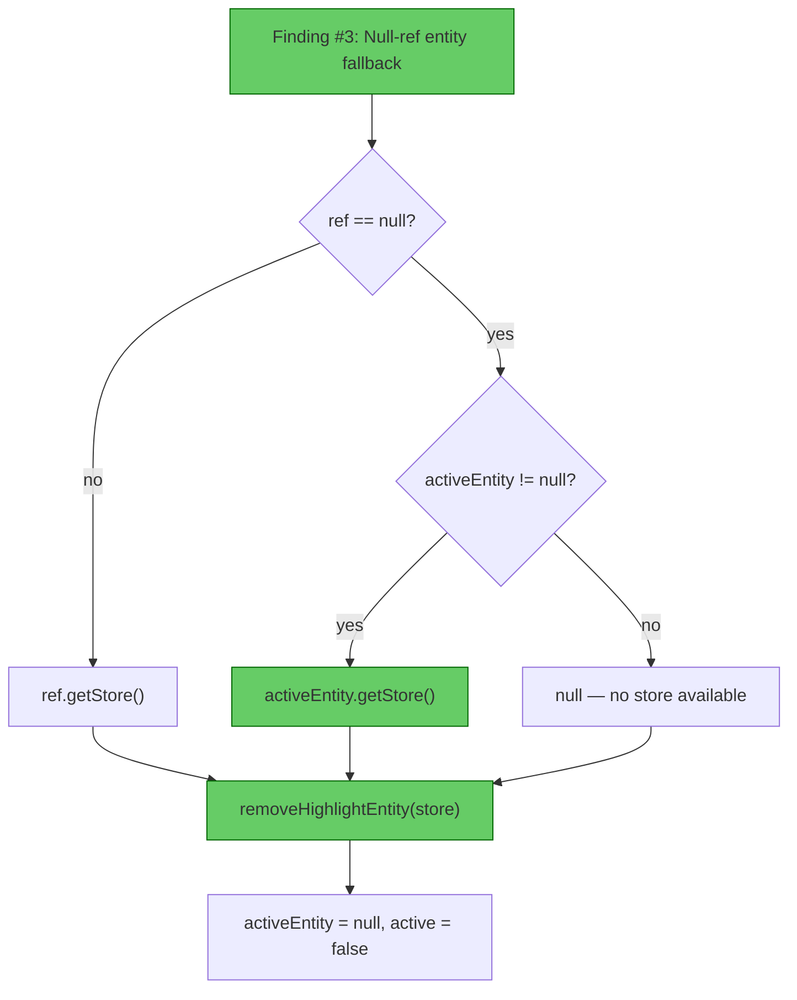

# Verification: StencilBookParticleLoop Queue Guard

**Original review:** `docs/review-stencil-book-particle-loop-queue-guard.md`  
**File verified:** `src/main/java/com/CodeCreature/ui/stencilbook/StencilBookParticleLoop.java`  
**Date:** 2026-05-29  
**Mode:** Post-implementation verification

---

## Verdict: **PASS**

Finding #3 is properly resolved. No new issues introduced. No regressions detected.

---

## Resolution Status

| # | Category | Severity | Original Finding | Status |
|---|----------|----------|------------------|--------|
| 1 | Correctness | 🔵 Informational | Queue guard is correct | ✅ Resolved (no change needed — was informational) |
| 2 | Correctness | 🔵 Informational | Shutdown ordering is correct | ✅ Resolved (no change needed — was informational) |
| 3 | Safety | 🟡 Should Fix | Entity reference dropped without removal when player ref is null | ✅ **Resolved** — see analysis below |
| 4 | Safety | 🟠 QA | Entity leaks if `world.execute()` throws in `shutdown()` | ✅ Resolved (no change needed — was QA/verify item) |
| 5 | Performance | 🔵 Informational | Scheduled task keeps firing after `active = false` | ✅ Resolved (no change needed — was informational) |
| 6 | Correctness | 🔵 Informational | `pending.set(false)` catch-block improvement over AffordabilityCoalescer | ✅ Resolved (no change needed — was informational) |
| 7 | Correctness | 🔵 Informational | `EFFECT_DURATION_MILLIS = 500` is correct | ✅ Resolved (no change needed — was informational) |

---

## Finding #3 — Detailed Resolution Analysis

### Before (entity leak)

```java
Ref<EntityStore> ref = playerRef.getReference();
if (ref == null || !ref.isValid()) {
    removeHighlightEntity(null);  // ← null store, entity ref dropped
    active = false;
    return;
}
```

### After (fixed — line 113)

```java
Ref<EntityStore> ref = playerRef.getReference();
if (ref == null || !ref.isValid()) {
    removeHighlightEntity(ref != null ? ref.getStore() : (activeEntity != null ? activeEntity.getStore() : null));
    active = false;
    return;
}
```

### Fix flow



### Correctness check

The fix covers all three cases in the `ref == null || !ref.isValid()` branch:

1. **`ref` is non-null but invalid** → uses `ref.getStore()` to obtain the store. The `removeHighlightEntity` guard (`activeEntity.isValid()`) prevents removal of an already-invalid entity.
2. **`ref` is null, `activeEntity` exists** → falls back to `activeEntity.getStore()`. This is the entity leak path that was broken before — now the store is retrieved from the entity itself, and `removeHighlightEntity` properly calls `store.removeEntity()`.
3. **`ref` is null, `activeEntity` is null** → passes `null`. No entity to remove, no leak possible.

### Minor deviation from suggested fix

The suggested fix included `activeEntity.isValid()` in the fallback ternary:
```java
activeEntity != null && activeEntity.isValid() ? activeEntity.getStore() : null
```

The implementation omits the `isValid()` check:
```java
activeEntity != null ? activeEntity.getStore() : null
```

This is **functionally equivalent** because `removeHighlightEntity` already guards the removal call with `activeEntity != null && activeEntity.isValid() && store != null`. If `activeEntity` is non-null but invalid, `getStore()` returns the store, but removal is skipped by the method's own guard — matching the intended behavior (the entity was already removed externally, just clear the reference).

---

## New Issues Check

No new issues detected:

- **No new anti-patterns** — the fix is a single-expression change in the existing conditional
- **No new state management concerns** — the fallback chain is deterministic and null-safe
- **No type errors** — all branches of the ternary resolve to `Store<EntityStore>` or `null`, matching the `removeHighlightEntity` parameter type
- **No thread-safety regressions** — the fix runs inside `executeTick()` which is already on the world thread

---

→ @Engineer No further action required on this file  
→ @Engineer Consider backporting the `pending.set(false)` catch-block pattern to `AffordabilityCoalescer.markDirty()` (original finding #6, still informational)
